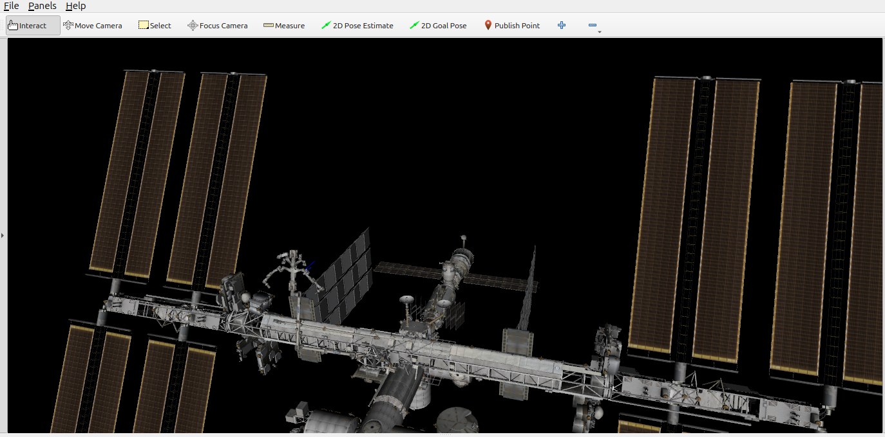
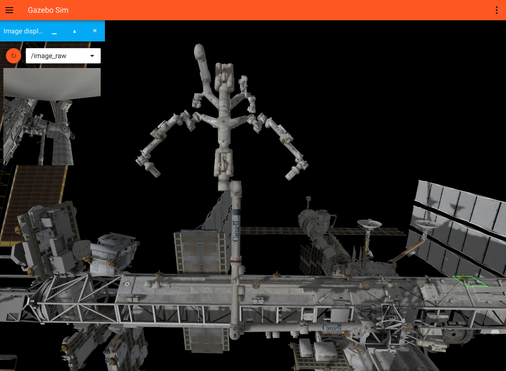

ISS Description
================

Package that has a simulation of the ISS and the Mobile Servicing System (MSS) composed of 3 parts:

1. Mobile Base System (MBS): Rack that travels along the trusses outside the ISS
2. Canadarm2: 7-DOF arm that can be attached to the MBS
3. Dextre: 15 DOF (2 arms with 7DOFs each and one roll hip joint) that can be attached to Canadarm2, MBS or the ISS surface.


Instructions
=============

1. To visualize the system in Rviz and move the joints using a Joint State Publisher GUI:

    ```
    ros2 launch iss_description view_mobile_servicing_system.launch.py
    ```
    
    
    
2. To simulate the system in Gazebo: 

   ```
    ros2 launch iss_description mobile_servicing_system_gz.launch.py
   ```
   
   To move the DOFs you can use the services offered by the node in  scripts/move_mss. This script is run by default with the launch file above. It offers services for moving the Canadarm2, Dextre and the mobile system, e.g.:
   
   ```
   ros2 service call /canadarm2_pose_1  std_srvs/srv/Empty    
   ``` 
   
   

